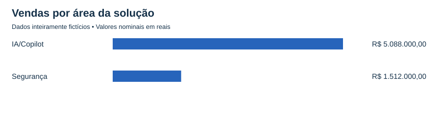

# Análise comercial de soluções de IA e Segurança

Projeto de portfólio de Victor Souza: preparação de dados, consultas SQL e análise exploratória de oportunidades ganhas.

**Estudo simulado com dados inteiramente fictícios.** A pergunta de negócio foi inspirada em um contexto de vendas de tecnologia. Este repositório não contém exportações do CRM, nomes de clientes, identificadores ou valores da empresa. Os resultados não devem ser apresentados como conquistas profissionais reais.

## Pergunta de negócio

Quais soluções e clientes concentram o valor das vendas ganhas e como esse valor se distribui em períodos comparáveis?

O público da análise é uma liderança comercial ou de Customer Success que precisa decidir quais ofertas investigar e quais relacionamentos acompanhar mais de perto.

## Entregas

- Base pública sintética e gerador reproduzível.
- Validação de identificadores, datas, valores e classificação.
- Consultas SQL executadas em SQLite pelo Python.
- Vendas, quantidade, ticket médio e concentração de clientes.
- Gráficos e [relatório de conclusões](reports/resultados.md).



## Como reproduzir

Requisito: Python 3.10 ou superior. Apenas bibliotecas padrão; não há pacotes para instalar. Abra o terminal na pasta deste projeto e execute:

```bash
python src/gerar_dados.py
python src/analisar.py
python -m unittest discover -s tests
```

No Windows, use `py` no lugar de `python` se esse for o comando disponível. A base já está incluída: o primeiro comando só é necessário para regenerá-la. Os resultados são gravados em `reports/`. O banco SQLite é temporário, criado em memória.

## Método

1. Gerar uma base fictícia com semente fixa, sem ler a base privada.
2. Conferir IDs únicos, clientes preenchidos, datas válidas e valores não negativos com até duas casas decimais.
3. Padronizar nomes e classificar Copilot/COPIOT como IA, soluções de proteção como Segurança e PAL/CPOR como Parcerias de TI. O erro COPIOT é inserido propositalmente para demonstrar a regra de tratamento.
4. Separar parcerias dos indicadores comerciais. Elas permanecem contabilizadas na auditoria.
5. Calcular os indicadores por SQL e reconciliar o total com a soma independente em Python, usando centavos inteiros.
6. Comparar janeiro a agosto dos dois anos e apresentar hipóteses de ação com limites explícitos.

## Definições

| Indicador | Cálculo |
|---|---|
| Vendas | Soma do valor das oportunidades de soluções |
| Quantidade | Contagem de oportunidades de soluções, incluindo eventuais valores zero |
| Ticket médio | Vendas / quantidade de oportunidades de soluções |
| Concentração dos cinco maiores | Vendas dos cinco maiores clientes / vendas de soluções |

Valor vendido não equivale automaticamente a caixa recebido ou receita contábil reconhecida. A simulação não contém custos, margem ou ajustes cambiais.

## Estrutura e aprendizagem

| Caminho | O que contém |
|---|---|
| `data/` | Somente dados sintéticos |
| `src/gerar_dados.py` | Construção da simulação |
| `src/analisar.py` | Tratamento, SQL e geração de resultados |
| `sql/analise.sql` | Consultas comentadas |
| `reports/` | Resultados e gráficos reproduzíveis |
| `docs/` | Dicionário e roteiro de estudo/publicação |
| `tests/` | Verificação de duplicatas, valores e regras de classificação |

## Limitações

Os padrões de vendas são artificiais. Esta base não valida demanda de mercado nem desempenho de uma empresa. Só existem oportunidades ganhas: não é possível estimar conversão, churn ou forecast confiável. As recomendações são propostas analíticas, não ações executadas.

## Autoria e transparência

Projeto desenvolvido com assistência de IA na estrutura, código e documentação. O contexto comercial e as regras foram discutidos com Victor Souza. O roteiro de estudo orienta a revisão e reprodução pelo autor; o repositório não declara domínio técnico ou resultados de negócio ainda não demonstrados.

Comece pelo [roteiro de estudo](docs/COMECE_AQUI.md) e pelo [dicionário dos dados](docs/dicionario.md).
