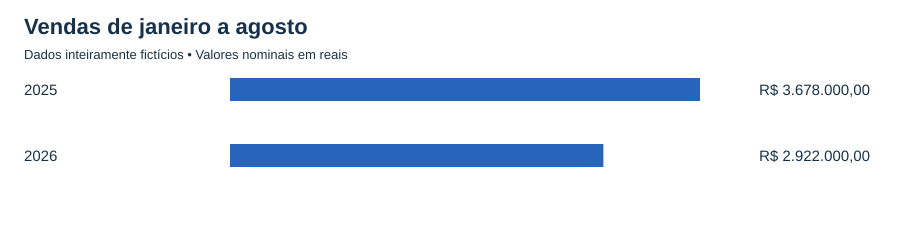
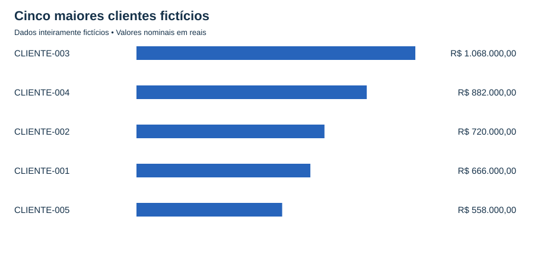

# Resultados da simulação

**Todos os resultados abaixo são fictícios. Não representam desempenho profissional ou empresarial real.**

- Registros: 120; oportunidades comerciais: 98; parcerias: 22.
- Vendas de soluções: R$ 6.600.000,00.
- Ticket médio: R$ 67.346,94.
- Participação dos cinco maiores clientes: 59,00%.

| Área | Oportunidades | Vendas (R$) | Ticket (R$) |
|---|---:|---:|---:|
| IA/Copilot | 58 | 5.088.000,00 | 87.724,14 |
| Segurança | 40 | 1.512.000,00 | 37.800,00 |

## Clientes com oportunidades em Copilot e Segurança

Cruzamento por cliente_id em todo o período disponível. Cada cliente é contado uma vez no perfil. Não há exigência de ordem entre as contratações. PAL/CPOR não entram neste comparativo.

| Perfil | Clientes | Participação nos clientes |
|---|---:|---:|
| Ambas | 11 | 44,00% |
| Somente Copilot | 10 | 40,00% |
| Somente Segurança | 4 | 16,00% |

Os 11 clientes com ambas as frentes somam R$ 4.836.000,00, equivalentes a 73,27% das vendas de soluções.

| Cliente | Oportunidades Copilot | Oportunidades Segurança | Vendas Copilot (R$) | Vendas Segurança (R$) | Total (R$) |
|---|---:|---:|---:|---:|---:|
| CLIENTE-003 | 10 | 6 | 912.000,00 | 156.000,00 | 1.068.000,00 |
| CLIENTE-004 | 6 | 9 | 528.000,00 | 354.000,00 | 882.000,00 |
| CLIENTE-002 | 6 | 5 | 552.000,00 | 168.000,00 | 720.000,00 |
| CLIENTE-001 | 7 | 1 | 624.000,00 | 42.000,00 | 666.000,00 |
| CLIENTE-005 | 5 | 6 | 336.000,00 | 222.000,00 | 558.000,00 |
| CLIENTE-029 | 3 | 2 | 216.000,00 | 84.000,00 | 300.000,00 |
| CLIENTE-030 | 1 | 1 | 144.000,00 | 42.000,00 | 186.000,00 |
| CLIENTE-007 | 1 | 1 | 96.000,00 | 60.000,00 | 156.000,00 |
| CLIENTE-028 | 2 | 1 | 96.000,00 | 60.000,00 | 156.000,00 |
| CLIENTE-015 | 1 | 1 | 48.000,00 | 42.000,00 | 90.000,00 |
| CLIENTE-006 | 1 | 1 | 24.000,00 | 30.000,00 | 54.000,00 |

[Comparativo completo dos clientes](comparativo_clientes.csv)

A presença conjunta descreve a carteira, mas não demonstra que uma venda causou outra. Clientes com uma única frente podem ser avaliados quanto a necessidades complementares em qualquer direção. A ausência de contratação não comprova demanda.

## Consultas SQL executadas no VS Code

As consultas foram executadas em SQLite, e os resultados foram
conferidos com os indicadores apresentados neste relatório.

| Consulta | Objetivo |
|---|---|
| [Receita por área](../sql/receita_por_area.sql) | Comparar quantidade de oportunidades, receita e ticket médio de Copilot e Segurança. |
| [Principais clientes](../sql/top_clientes.sql) | Identificar os cinco clientes com maior receita comercial. |
| [Clientes nas duas áreas](../sql/clientes_ambas_areas.sql) | Identificar clientes com oportunidades tanto em Copilot quanto em Segurança. |
| [Perfis de clientes](../sql/perfil_clientes.sql) | Contar clientes com ambas as áreas, somente Copilot ou somente Segurança. |

### Conceitos praticados

- Filtragem com WHERE e IN.
- Agrupamento com GROUP BY.
- Agregações com COUNT, SUM e AVG.
- Arredondamento com ROUND.
- Ordenação e seleção dos maiores valores com ORDER BY e LIMIT.
- Contagem condicional com CASE.
- Filtragem de grupos com HAVING e COUNT DISTINCT.
- Organização da consulta em etapas com WITH.
